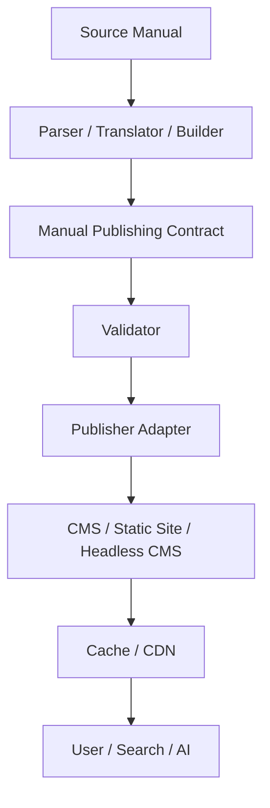

# Architecture

> This document is a translation. The Japanese specification is canonical in case of discrepancies.

The contract is a data boundary, not a transformation or delivery system.

Converters produce contract-conforming data, validators inspect it, and publisher adapters map it to delivery systems. Every implementation can be replaced; no vendor, CMS, or AI provider is required. Build-time artifacts retain source identity, manual version, section/page mappings, publication metadata, and evidence.
