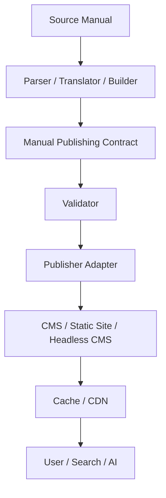

# Architecture

Manual Publishing Contractは変換処理や配信基盤ではなく、その間を結ぶデータ境界です。

Parser/translator/builderはsourceをContract適合データへ変換します。Validatorはschema、参照、provenanceを検査します。Publisher adapterはContractを特定CMSやstatic siteへ写像します。どの実装も交換可能で、Contractは特定vendor、CMS、AI providerを要求しません。

build-time生成を基本とし、公開時の成果物はsource identity、manual version、section/page mapping、publication metadata、evidenceを失ってはなりません。
