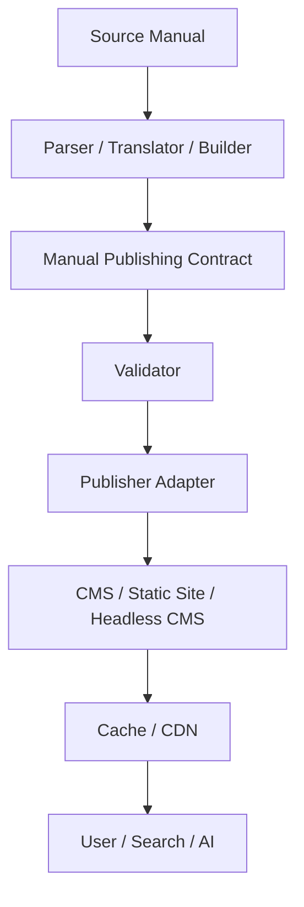

# 架构

> 本文档为翻译版本。如与日文规范存在差异，以日文规范为准。

本Contract是数据边界，不是转换或发布系统。

转换器生成符合Contract的数据，Validator进行检查，Publisher Adapter映射到发布系统。所有实现都可以替换，Contract不要求特定vendor、CMS或AI provider。build-time成果物保留source identity、manual version、章节/页码映射、发布metadata和Evidence。
